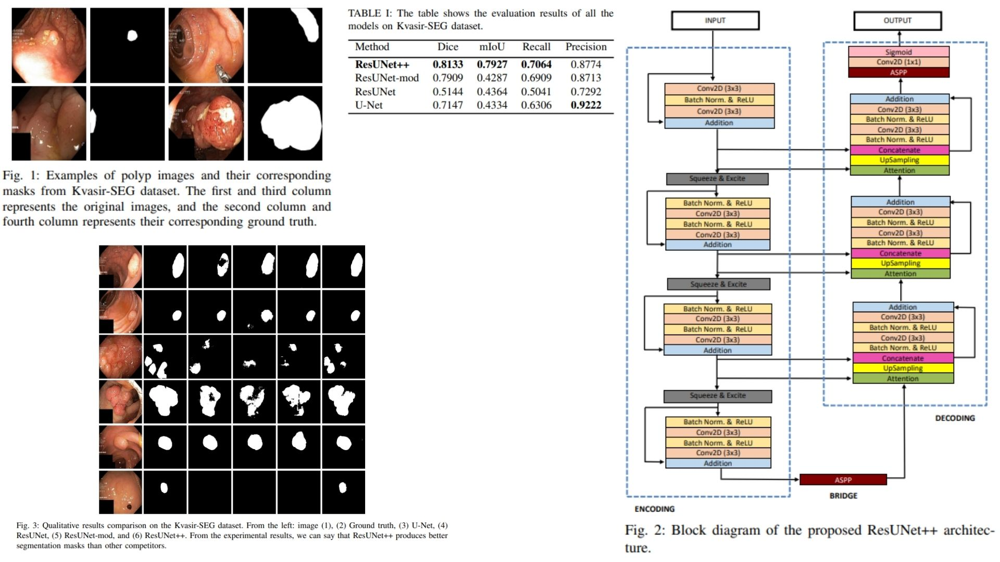

# 🩺 ResUNetPlusPlus-Replication — Advanced Polyp Segmentation

This repository provides a **faithful Python replication** of the **ResUNet++ framework** for colonoscopic image segmentation.  
It implements the pipeline described in the original paper, including **residual units, attention gates, squeeze & excitation, and ASPP modules**.

Paper reference: *[ResUNet++: An Advanced Architecture for Medical Image Segmentation](https://arxiv.org/abs/1911.07067)*  

---

## Overview 🌿



> ResUNet++ improves classical U-Net by leveraging **residual connections, channel attention, and multi-scale context**, enabling precise **pixel-wise polyp segmentation**.

Key points:

* **Encoder** produces hierarchical feature maps $$E_i$$ with residual blocks and Squeeze & Excitation  
* **ASPP bridge** captures **multi-scale contextual information** $$B = \text{ASPP}(E_3)$$  
* **Decoder** fuses encoder features with **attention-enhanced skip connections** $$D_j = F(E_1,...,E_3, B)$$  
* **Segmentation head** outputs the final pixel-wise prediction $$\hat{Y} = \sigma(\text{Conv}_{1\times1}(D_1))$$  

---

## Core Math 🧮

**Residual Unit**:

$$
X_{out} = F(X_{in}) + X_{in}, \quad F = \text{Conv-BN-ReLU-Conv-BN}
$$

**Squeeze & Excitation (channel-wise attention)**:

$$
s_c = \sigma(W_2 \cdot \delta(W_1 \cdot z_c)), \quad z_c = \frac{1}{H \times W} \sum_{i,j} X_{c,i,j}
$$

**ASPP module (bridge)**:

$$
B = \text{Concat}(\text{Conv}_{3\times3}^{d_i}(X)), \quad i \in \{1,6,12,18\}
$$

**Attention gate in decoder**:

$$
\alpha = \sigma(\psi^T(\delta(W_x X_l + W_g G)))
$$

Where $X_l$ is the encoder feature, $G$ the decoder gating signal, $\delta$ is ReLU, and $\psi$ a 1×1 conv.

**Segmentation prediction**:

$$
\hat{Y} = \sigma(\text{Conv}_{1\times1}(D_1))
$$

---

## Why ResUNet++ Matters 🌟

* Combines **residual learning** and **attention mechanisms** for improved segmentation  
* Captures **multi-scale context** via ASPP for robust performance  
* Achieves **state-of-the-art segmentation accuracy**, outperforming U-Net and ResUNet

---

## Repository Structure 🏛️

```bash
ResUNetPlusPlus-Replication/
├── src/
│   ├── blocks/                     
│   │   ├── residual_block.py       # Residual Unit (F(x)+x)
│   │   ├── se_block.py             # Squeeze & Excitation
│   │   ├── attention_block.py      # Attention Gate
│   │   ├── aspp.py                 # ASPP module (dilations=[1,6,12,18])
│   │   └── stem_block.py           # Initial conv block
│   │
│   ├── encoder/
│   │   └── encoder.py              # Produces E1, E2, E3
│   │
│   ├── bridge/
│   │   └── aspp_bridge.py          # ASPP bridge connecting encoder to decoder
│   │
│   ├── decoder/
│   │   └── decoder.py              # Produces D1, D2, D3 with attention & skip fusion
│   │
│   ├── head/
│   │   └── segmentation_head.py    # 1x1 Conv + Sigmoid
│   │
│   ├── model/
│   │   └── resunetplusplus.py      # Full model orchestration
│   │
│   └── config.py                   # base_channel, learning_rate, num_classes, device
│
├── images/
│   └── figmix.jpg                   
│
├── requirements.txt
└── README.md
```

---

## 🔗 Feedback

For questions or feedback, contact:  
[barkin.adiguzel@gmail.com](mailto:barkin.adiguzel@gmail.com)
